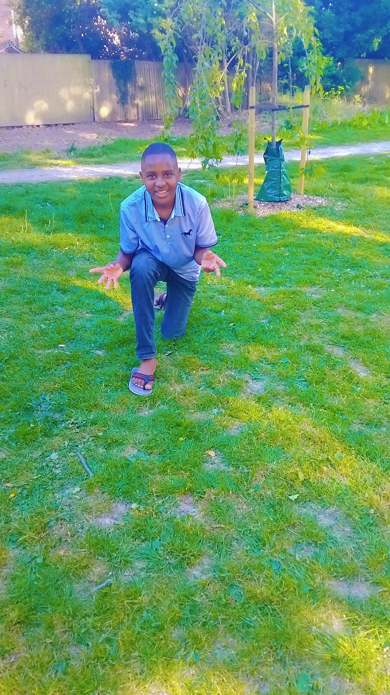

# Jovan Kaliisa - Founder AccessUg

### 16y/o S3 Innovator | Masaka Nkoni, Uganda

My name is Jovan Kaliisa, S3 student at Archbishop Kiwanuka Secondary School, Masaka. I built AccessUg - Free Offline School Management System 100% on phone using Spck Editor.

**AccessUg is live:**
- Platform: https://jovankaliisa.github.io/AccessUg/
- Code: https://github.com/jovankaliisa/AccessUg
- 5 Schools in Masaka Nkoni using it

**About Me:**
- Founder: AccessUg
- Age: 16y/o, S3
- School: Archbishop Kiwanuka SS
- Location: Masaka, Uganda
- Built on: Tecno phone, no laptop

Contact: github.com/jovankaliisa
<!--
**jovankaliisa/jovankaliisa** is a ✨ _special_ ✨ repository because its `README.md` (this file) appears on your GitHub profile.

Here are some ideas to get you started:

- 🔭 I’m currently working on ...
- 🌱 I’m currently learning ...
- 👯 I’m looking to collaborate on ...
- 🤔 I’m looking for help with ...
- 💬 Ask me about ...
- 📫 How to reach me: ...
- 😄 Pronouns: ...
- ⚡ Fun fact: ...
-->
